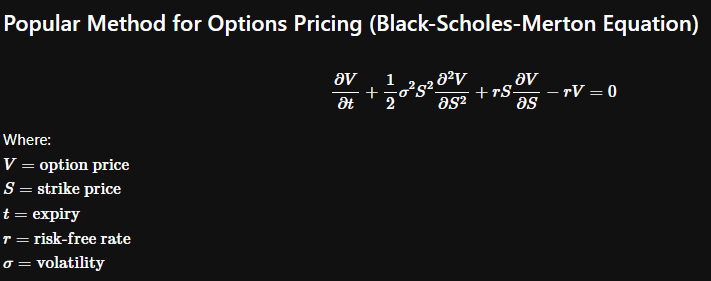
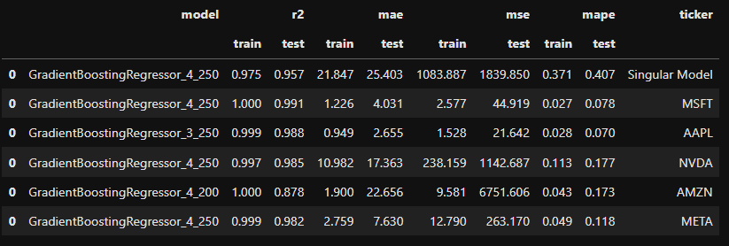
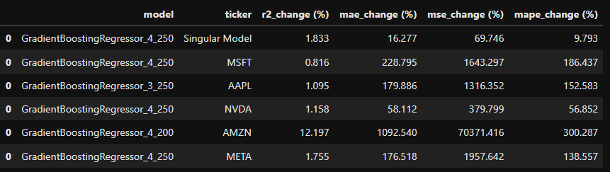
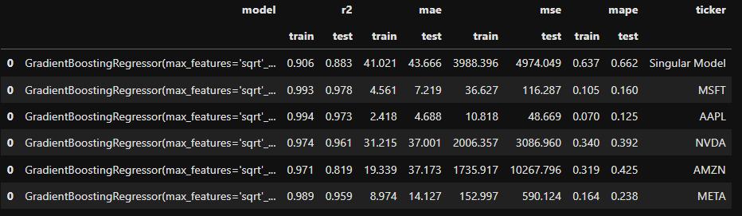
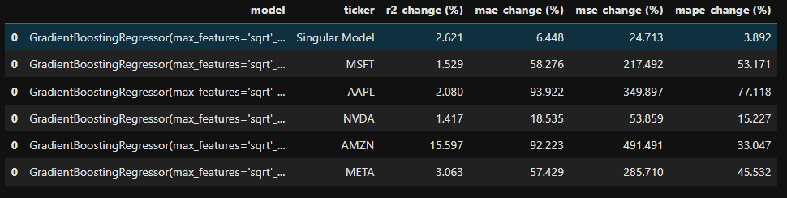
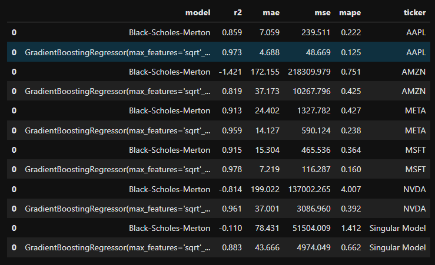
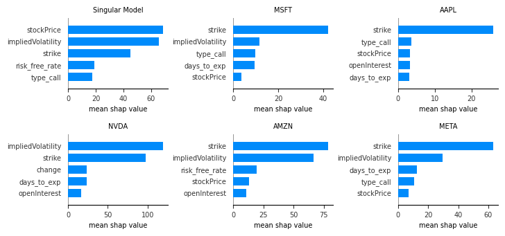
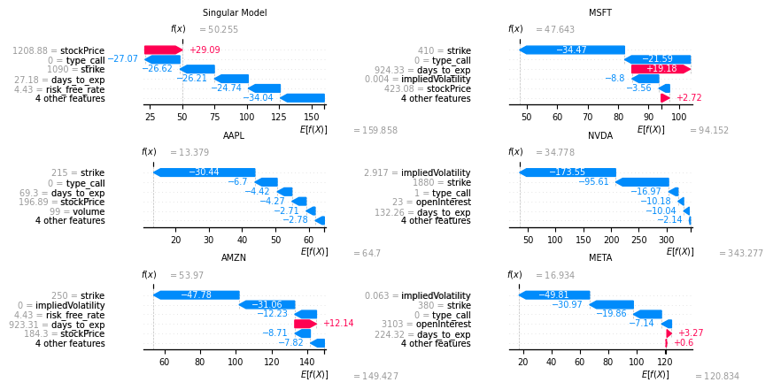

# Machine Learning 2 Final Project

- [View Notebook](ml_final_project_final-regularization.ipynb) 

## Intoduction

This project aims to use ML models as an alternative to pricing options aside from the more popular and traditionally used Black-Scholes-Merton equation. Finance data was obtained from Yahoo! Finance via webscraping and Linear and Tree Models were used as prospective models for Machine Learning.

## Model Results

### Without regularization
Train-Test Model performance metrics:

Train-Test Model performance metrics % difference:

### With regularization
Train-Test Model performance metrics:

 Train-Test Model performance metrics % difference:

## Comparison vs. Black-Scholes-Merton
Baselines vs. Best Model performance metrics regularized

## Top feature predictors in terms of mean SHAP value

## Feature contribution to option price for a certain instance per model

